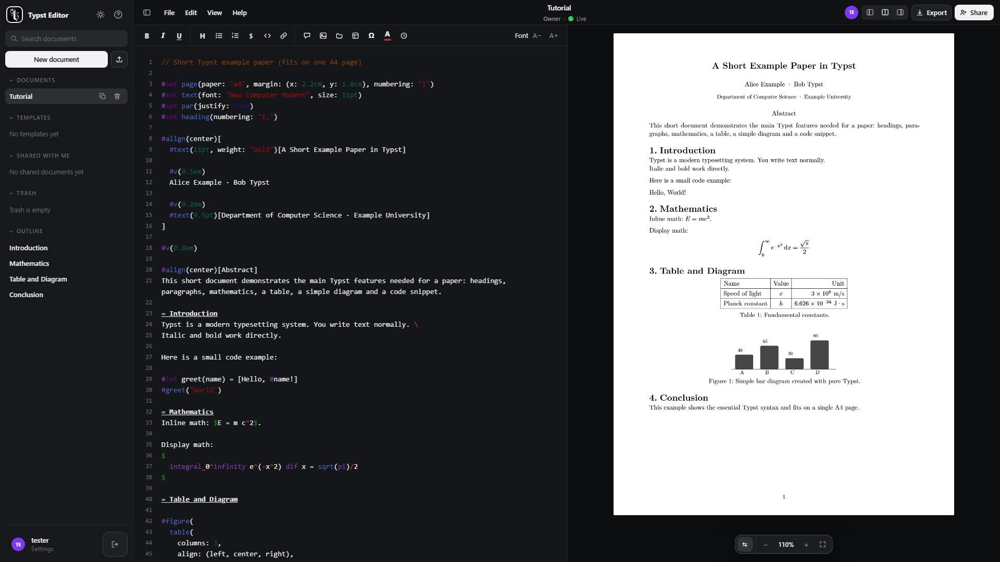

# Typst Editor

CI: [.github/workflows/ci.yml](.github/workflows/ci.yml)

Collaborative Typst editor in the browser: code on the left, live PDF on the right.
One process (FastAPI + pycrdt), SQLite storage, no Node needed at runtime.



## Quickstart

```bat
python -m venv .venv
.venv\Scripts\activate
pip install -r requirements.txt
uvicorn backend.main:app --host 127.0.0.1 --port 8000
```

Open `http://127.0.0.1:8000`, register, start writing.

Rebuild the CodeMirror bundle (only after `cm-build/entry.js` changes):

```bat
cd cm-build && npm run build
```

## Test

```bat
pip install -r requirements-dev.txt
pytest -q
```

## Features

- Editor with Typst highlighting, live PDF preview, and click-sync both ways
- Live sync via Yjs/pycrdt with presence, autosave, and history (diff + restore)
- Docs with folders, full-text search, trash, duplicate, and comments (@-mentions)
- Sharing by username or link token with owner/editor/reviewer roles
- File uploads (`#image`/`#include` per click) and export (`.typ`, PDF, PNG, SVG)
- Backup of all docs as `.zip` (Settings -> Backup), PWA shell with offline dot

## Limits

- History: max 50 snapshots per doc, auto-snapshot at most every 15 minutes
- Reviewer role is read-only (server drops their sync updates)
- No git-remote sync; use ZIP backup or `.typ` download instead
- Passwords: minimum 8 characters

## Security

Local-first: run behind `127.0.0.1`, no rate limiting yet. See [SECURITY.md](SECURITY.md).

## License

License TBD, see [LICENSE-TODO.md](LICENSE-TODO.md).

## Internal notes

- [BASELINE.md](BASELINE.md), [ROADMAP.md](ROADMAP.md)
- [CONTRIBUTING.md](CONTRIBUTING.md)
