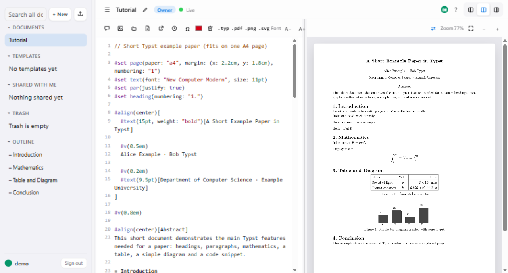

# 📝 Typst Editor

[](https://github.com/fl-grtg/typst-editor/actions/workflows/ci.yml) [](https://github.com/fl-grtg/typst-editor/actions/workflows/docker.yml) [](./LICENSE)

Collaborative Typst editor in the browser: code on the left, live PDF on the right.

One process: FastAPI serves the API, Yjs syncs the edits, and SQLite stores everything. No Node needed at runtime.



## ✨ Features

- Live PDF preview, compiled in the browser via Typst WASM
- Realtime collaboration with presence over a cookie-only WebSocket
- Owner/editor/reviewer roles with share links and doc invites
- Comment threads with anchors, @-mentions, replies, resolve
- Outline, symbol picker, autocomplete, find/replace
- File uploads for `#image` and `#include`
- Templates per account with folders, reused via `#include`
- History with snapshots, diff view, one-click restore
- Folders, trash, duplicate, global search
- Export as `.typ`, PDF, SVG, first-page PNG, or all docs as one `.zip` (`.typ`/PDF/SVG/PNG render client-side via Typst WASM; only the all-docs `.zip` is built server-side via `GET /api/export.zip`)
- Autosave + 24 h local stash, offline app shell, font/zoom settings
- Per-user quotas and per-endpoint rate limits, enforced server-side

## 🚀 Get Started

With Docker (under 5 minutes, no config files needed):

```bash
docker compose up -d
docker compose logs app | grep "invite code"
# Windows PowerShell: docker compose logs app | Select-String "invite code"
```
Pulls the image automatically (`pull_policy: always`). Data lives in a managed Docker volume (zero setup). Host path instead: set `COMPOSE_DATA_PATH` (Linux/macOS/WSL: `chown -R 999:999` on that dir; Docker Desktop on Windows usually needs nothing — named volumes and bind mounts inherit usable permissions).

Sign up at `http://127.0.0.1:8978` with the invite code from the logs. Only needed for custom setups: `cp .env.example .env` (proxy, other data path, other port).
Custom port: set `PORT` in `.env` — Compose maps `127.0.0.1:${PORT:-8978}:${PORT:-8978}` (host:container), so one variable moves both sides.
Build locally instead of pulling: `docker build -t ghcr.io/fl-grtg/typst-editor:main .`.

Or locally with Python 3.11:

```bash
python -m venv .venv
.venv\Scripts\activate  # Windows (source .venv/bin/activate on Linux/macOS)
pip install -r requirements.txt
uvicorn backend.main:app --host 127.0.0.1 --port 8978 --workers 1
```

Registration defaults to `invite-only`. Fresh Docker installs generate an invite token on first start (see logs, stored `chmod 600` as `DATA_DIR/.invite_token`) — every account including the first needs it. Set your own token before first start on public servers (`openssl rand -hex 32`). Without a token (bare-metal default), the first account registers freely (bootstrap). Use `open` for local tests only, never on the public internet.

## ⚙️ Configuration

File plus env overrides; env wins (parsed and validated in `backend/config.py`, the single source of truth; `.env.example`/`config.example.toml` mirror it).

| ENV | Default | Notes |
| --- | --- | --- |
| `DATA_DIR` | `./data` | SQLite plus uploads; `/app/data` in the container. Needs restart when changed. |
| `COMPOSE_DATA_PATH` | managed volume | Optional host path instead, e.g. `/srv/typst-data`. |
| `TRUST_PROXY` | `false` | Required `true` behind a proxy, else cookies break. Set in `config.toml` or `.env`; env wins. |
| `REGISTRATION` | `invite-only` | `closed`, `invite-only`, or `open`. |
| `REGISTRATION_INVITE_TOKEN` | empty | `openssl rand -hex 32`. |
| `SESSION_SECONDS` | `1209600` | 14 days. |
| `MAX_DOCS_PER_USER` | `100` | Plus 500 MB and 200 files per doc (see `backend/config.py`). |

Never commit local `config.toml` or `.env`; only the `.example` files are tracked.

## 📡 API

```bash
curl -s http://127.0.0.1:8978/healthz
```

Live sync runs over `WS /ws/{doc_id}`. Auth is cookie-only (`typst_session`, HttpOnly, SameSite=lax): API clients must store cookies, there is no token in body or URL.

## 💾 Backup

```bash
python scripts/backup.py --include-files
```

Writes `DATA_DIR/backup/app-YYYYMMDD-HHMMSS.db` via `VACUUM INTO` plus a `*-files.tar.gz` archive of `DATA_DIR/files`, keeps the newest 7 (`--keep N`, `--dry-run` to preview). `--include-files` defaults to on. `--keep 0` still keeps 1 (guard against purging everything). Run hourly via cron or `docker compose exec -T app python scripts/backup.py --include-files` (`-T`: no TTY, for cron/non-interactive use). Backups are unencrypted: `gpg -c DATA_DIR/backup/app-*.db`.

Restore: stop the server, copy the backup over `app.db` (`cp DATA_DIR/backup/app-....db DATA_DIR/app.db`), delete `app.db-wal`/`app.db-shm`, unpack files (`tar -xzf DATA_DIR/backup/app-...-files.tar.gz -C DATA_DIR`), fix ownership on host paths (`chown -R 999:999 DATA_DIR`), start. Verify with `PRAGMA integrity_check;` (the backup script already checks the backup copy before rotating).

## 🔌 Reverse proxy

`TRUST_PROXY=true` is required; never expose the app directly, TLS is your responsibility. Caddy:

```
typst.example.com {
    reverse_proxy 127.0.0.1:8978
}
```

nginx (full block — WebSocket needs `http_version 1.1` plus the `Upgrade`/`Connection` headers):

```
server {
    listen 443 ssl;
    server_name typst.example.com;
    ssl_certificate /etc/letsencrypt/live/typst.example.com/fullchain.pem;
    ssl_certificate_key /etc/letsencrypt/live/typst.example.com/privkey.pem;
    # e.g. via certbot: certbot --nginx -d typst.example.com (adjust paths to your setup)

    client_max_body_size 12M;

    location / {
        proxy_pass http://127.0.0.1:8978;
        proxy_http_version 1.1;
        proxy_set_header Host $host;
        proxy_set_header Upgrade $http_upgrade;
        proxy_set_header Connection "upgrade";
        proxy_set_header X-Forwarded-Proto $scheme;
        proxy_set_header X-Forwarded-For $proxy_add_x_forwarded_for;
        proxy_read_timeout 86400s;
        proxy_send_timeout 86400s;
        proxy_buffering off;
    }
}
```

Without `proxy_http_version 1.1` + `Upgrade`/`Connection`, the live sync WebSocket (`WS /ws/{doc_id}`) stays dead while plain HTTP works. `client_max_body_size 12M` covers 10 MB file uploads plus overhead. With a custom `PORT` in `.env`, point `reverse_proxy`/`proxy_pass` at that port instead of `8978`.

Always one worker (`--workers 1`) and one replica: rooms live in process memory. 512 MB RAM minimum, 1 GB recommended. No public demo instance; self-host.

Limits, openly: docs 200000 characters each (`MAX_TXT` in `backend/constants.py`, counted as characters so non-ASCII text can exceed 200 KB on disk); uploads 10 MB per file; 50 snapshots per doc, auto at most every 15 min; doc invites valid 7 days and redeemable any number of times within that window (the token is shown once at creation — copy it then); search needs 2 chars, max 20 hits; quotas 100 docs and 500 MB per user, 200 files per doc; reads share the `files_list` bucket (120/min), writes have their own.

### 🔒 Security Contact

Report vulnerabilities via GitHub Private Vulnerability Reporting.
Do not open public issues for security problems.
Allow time for a fix before any disclosure.

Unshare wipes all pending invite links for the doc (they carry no username). Preview needs internet on first load (CDN: cdnjs/esm.sh/jsdelivr — never cached by the service worker by design, always network); afterwards the shell works offline, saving needs network (24 h local stash). The server sends `Cache-Control: no-store` on `/`, `.html`, `.js` and `/api/*` (see `backend/main.py`), so the app shell always revalidates. CSP allows `unsafe-inline`/`unsafe-eval`/`wasm-unsafe-eval` plus pinned CDN origins — Typst WASM cannot run without them; user content is rendered via `textContent` only.

### 🛠 Troubleshooting

- First load needs internet (CDN), then shell offline. Check `#cdnLine` / console.
- Single worker only (`--workers 1`, also as CLI flag). Multi-worker exits on purpose.
- Behind proxy set `TRUST_PROXY=true`; appending via `$proxy_add_x_forwarded_for` is fine with a single proxy in front (no longer chain to preserve).
- Port `8978` loopback-only (override via `PORT` in `.env`); TLS via proxy.
- Permissions: managed volume needs nothing. Host path only: `chown -R 999:999` on it.
- `429` on reads: the shared `files_list` bucket (120/min) — slow down polling.

### 📦 Changelog

See GitHub Releases (no CHANGELOG file, single README on purpose).

## 💡 Why

Most collaborative editors either need heavy infrastructure or lock you into a cloud. This sits in the middle: one container you can self-host, enough collaboration to work together, little enough surface area to understand in one sitting.

## 📜 License

Apache-2.0, see `LICENSE`. Third-party versions and licenses in `NOTICE` (pins match the CDN imports and CSP entries).
